## 1st Question
     Target the Top description div and change the DEV Community 
     to <Your_Name> and description to your passion

## 1st Answer :
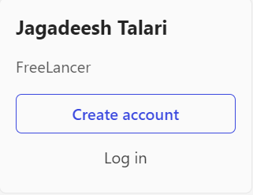

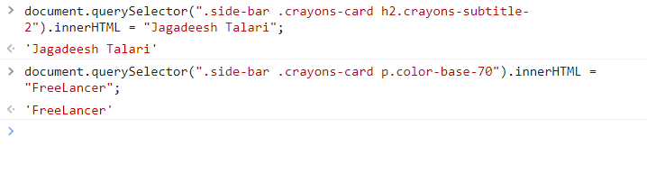

  

## 2nd Question
     Fetch all the product name and store in an array

## 2nd Answer :

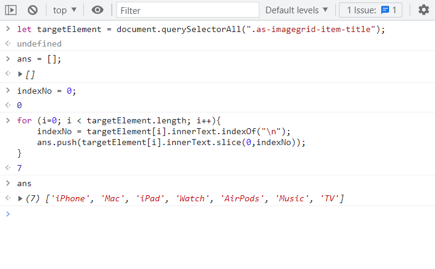

  

## 3rd Question
     Add another FAQ 'My New FAQ' to the list

## 3rd Answer :
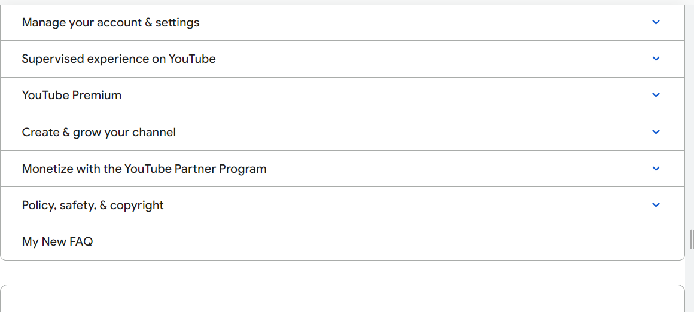

  

## 4th Question
     Change the contact number

## 4th Answer :
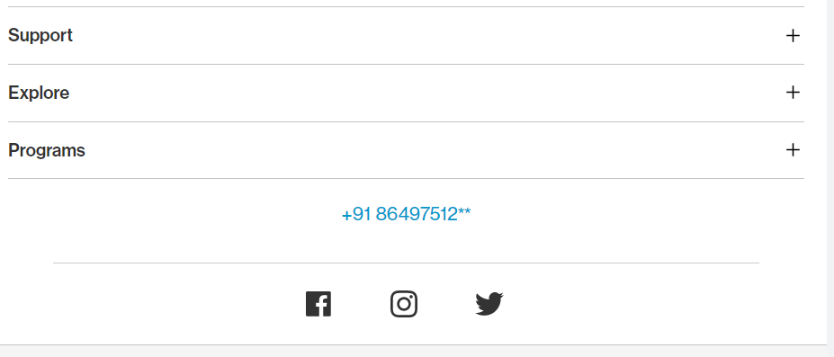

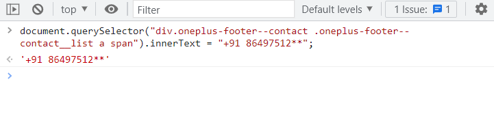

## 5th Question
     Change the contact number

## 5th Answer :
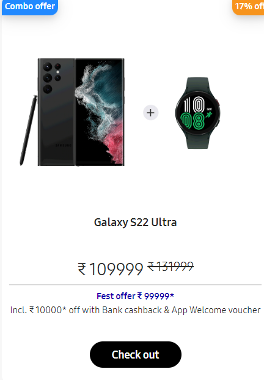

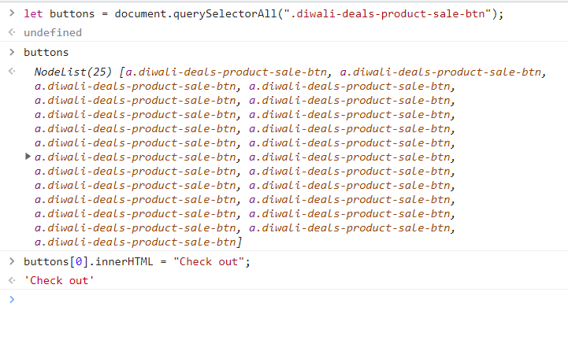

## 6th Question

     Target the search box and on hover change thebackground color to red.

## 6th Answer :

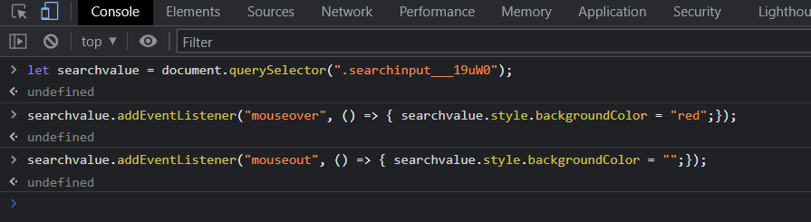

## 7th Question
     To Search a topic in the MDN Search bar.
 First add a text to search in the search bar and then hit the submit search button to search the docs using DOM

## 7th Answer :
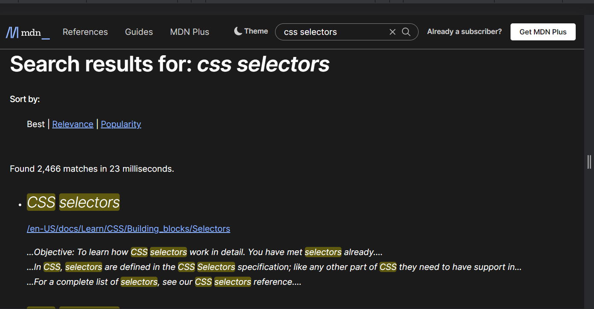

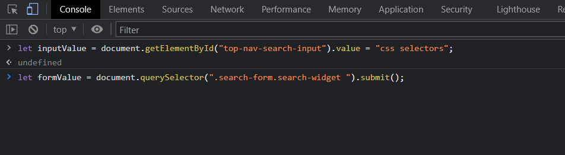

## 8th Question
     Remove alternate languages from the home page languages 
     listed

## Answer :
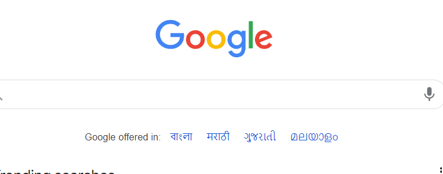

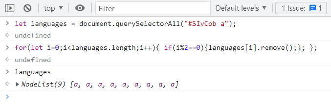

## 9th Question

Change the font family of the text to monospace and text color to the logo’s background color.

## Answer :

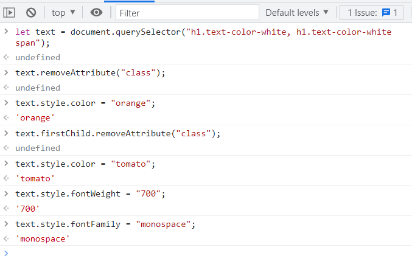

## 10th Question

Target the button and change background colour on mouseover

## Answer :

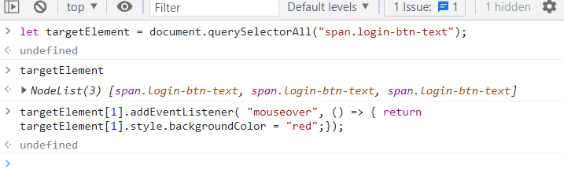

  

## 11th Question

change the realme logo to ineuron logo

## 11th Answer :

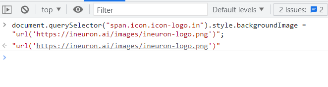

  

## 12th Question

   change the background colour of the button to blue.

## 12th Answer :
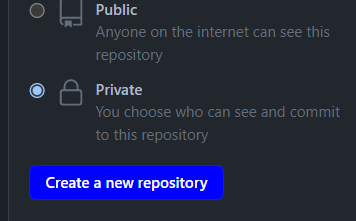

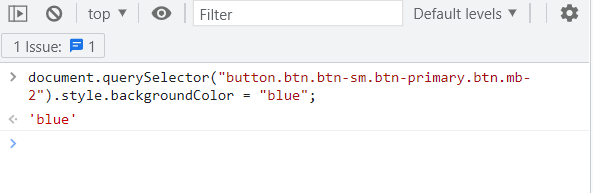

  

## 13th Question

Target the top description and change “Matching developers with great companies” to ‘JSBOOTCAMP“.

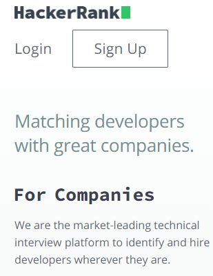

## 13th Answer :

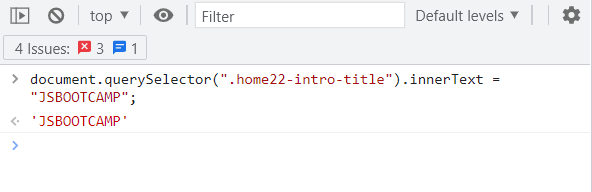

  

## 14th Question

  change the fontsize of “Hot Deals” to 80px

## 14th Answer :
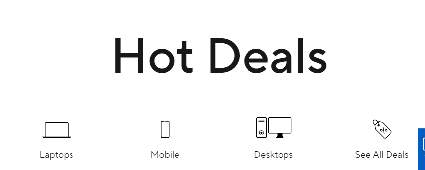

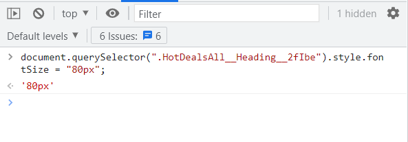

  

## 15th Question

Convert the text “G15 Gaming Laptop” from left to right

## 15th Answer :
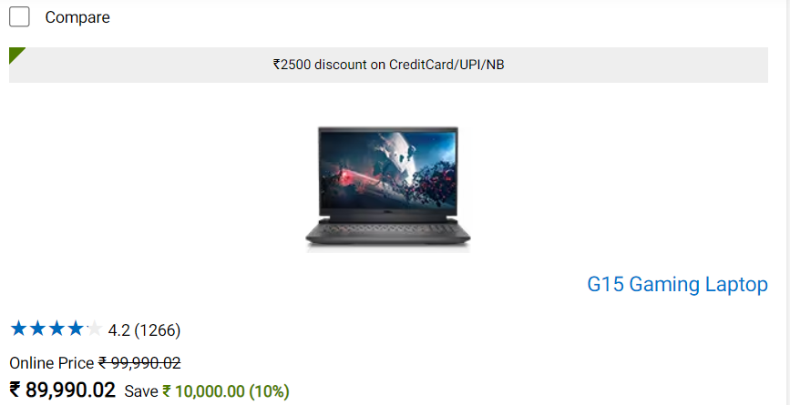

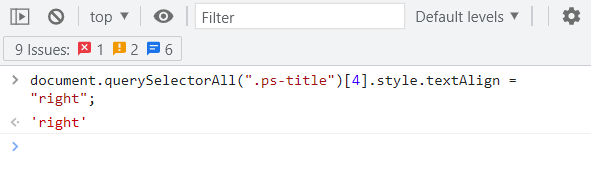

  

## 16th Question

change the heading “Start with the developer” to “Start with Scratch”

## 16th Answer :
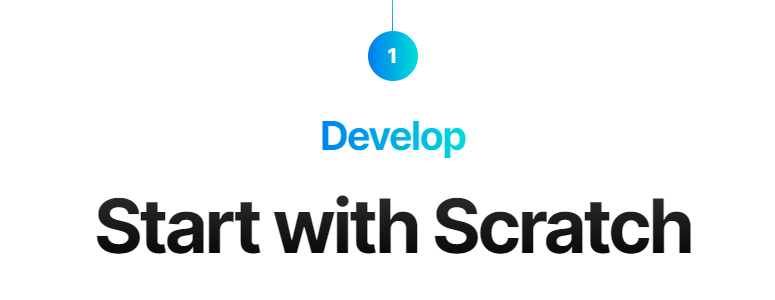

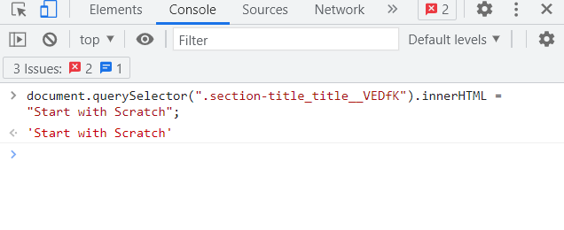

  

## 17th Question

change the button text To current Date.

## 17th Answer :

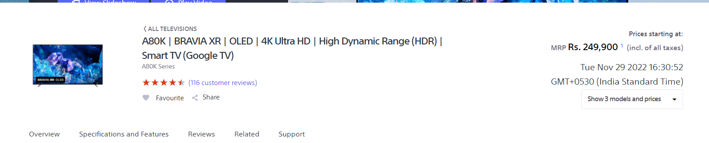

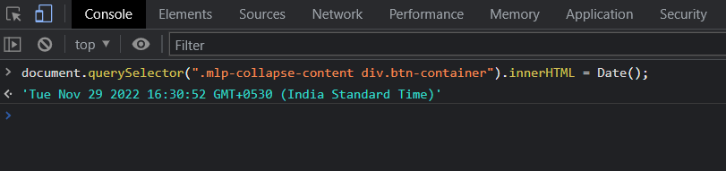

  

## 18th Question

change the background colour blue to orange

## 18th Answer :
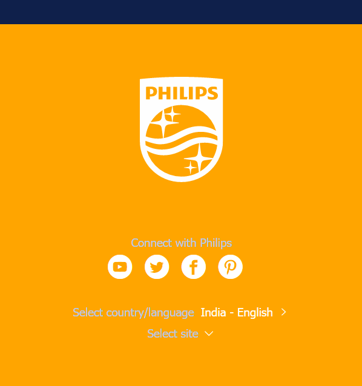

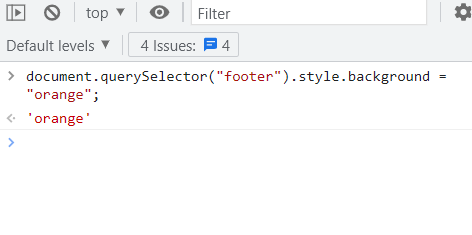

  

## 19th Question

     extract the canon logo

## 19th Answer :

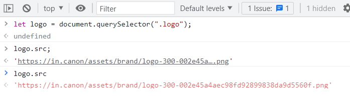

  

## 20th Question
     Change the description colour black to orange

## 20th Answer :
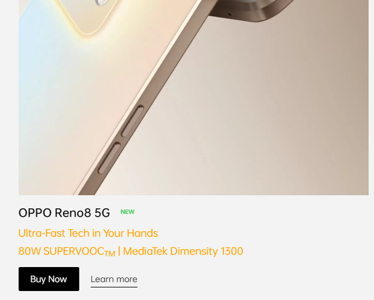

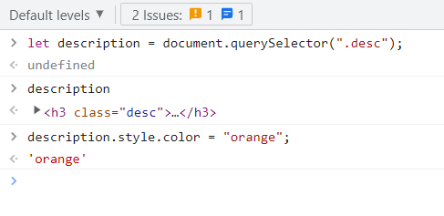

