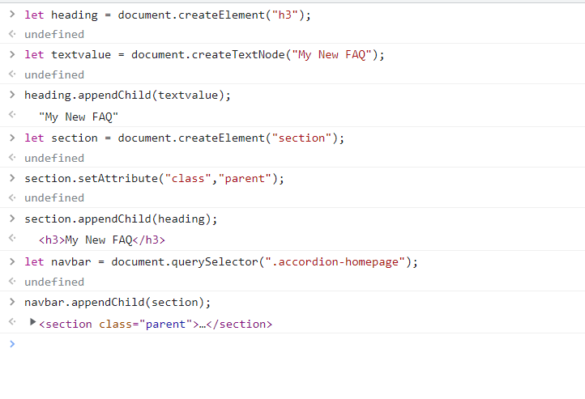
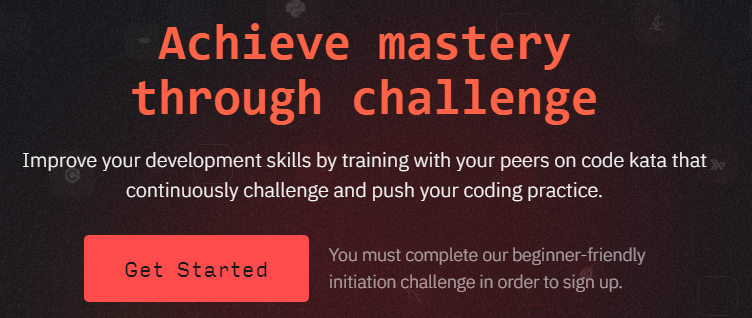

## 1st Question
     Target the Top description div and change the DEV Community 
     to <Your_Name> and description to your passion

## Answer :

## 2nd Question
     Fetch all the product name and store in an array

## Answer :

## 3rd Question
     Add another FAQ 'My New FAQ' to the list

## Answer :

## 4th Question
     Change the contact number

## Answer :

## 5th Question
     Change the contact number

## Answer :

## 6th Question
     Target the main div of card and change the Button text to Check out

## Answer :

## 8th Question
     Remove alternate languages from the home page languages 
     listed

## Answer :

## 9th Question

## Answer :

## 10th Question

## Answer :

## 8th Question

## Answer :

